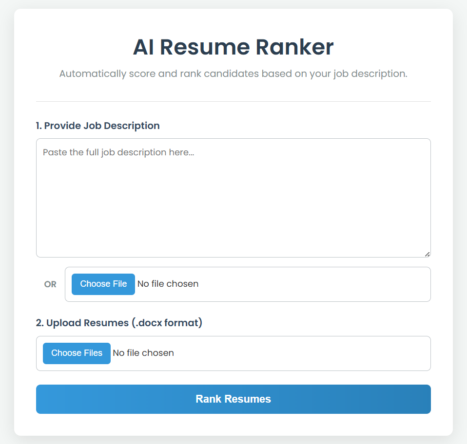

# AI Resume Ranker

An intelligent resume screening application that leverages Natural Language Processing (NLP) to automate the process of ranking candidates based on their relevance to a job description. This tool helps recruiters save time and identify the most qualified applicants efficiently.



---

## Key Features

-   **Hybrid Scoring Model:** Combines traditional keyword matching (TF-IDF) with advanced semantic similarity (spaCy Word Embeddings) for a highly accurate relevance score.
-   **Skill Highlighting:** Automatically extracts skills from the job description and highlights which ones are present in each candidate's resume.
-   **Intelligent Score Scaling:** The top candidate is always ranked at 100%, and all other scores are scaled relative to the best match, providing an intuitive ranking system.
-   **Web-Based Interface:** A clean and user-friendly interface built with Flask and HTML/CSS for easy uploading of job descriptions and multiple resumes.
-   **Flexible Input:** Supports both pasted text and `.docx` file uploads for job descriptions.

---

## How It Works

The application follows a sophisticated NLP pipeline to process and rank resumes:

1.  **Input:** The recruiter provides a job description (by text or file upload) and uploads one or more candidate resumes (`.docx`).
2.  **Text Extraction:** The text is parsed from all `.docx` files.
3.  **Skill Extraction:** Key skills are identified from the job description using a predefined skills list and NLP techniques.
4.  **Hybrid Scoring:** For each resume, two scores are calculated:
    -   **Keyword Score (60% Weight):** Uses `TF-IDF` with n-grams to find keyword and key-phrase overlap.
    -   **Semantic Score (40% Weight):** Uses `spaCy's` pre-trained language models to measure the contextual and semantic similarity between the resume and the job description.
5.  **Ranking:** The hybrid scores are scaled, with the top score set to 100%. Resumes are then ranked in descending order.
6.  **Output:** The results are displayed in a clean, card-based layout, showing each candidate's rank, final score, score breakdown, and matched skills.

---

## Setup and Installation

Follow these steps to set up the project locally.

### Prerequisites

-   Python 3.8+
-   A virtual environment tool (like `venv`)

### 1. Clone the Repository

```bash
git clone [https://github.com/](https://github.com/)kazmisohail/AIResumeRanker.git
cd ai-resume-ranker

```

### 2. Set up Virtual Environment

```
On Windows:
python -m venv venv
venv\Scripts\activate

On Linux/macOS
python3 -m venv venv
source venv/bin/activate

```
### 3. Install Dependencies

```
pip install -r requirements.txt

```

### 4. Download spaCy Language Model

```
python -m spacy download en_core_web_lg

```
### 5. Start the Server

```
flask run

```